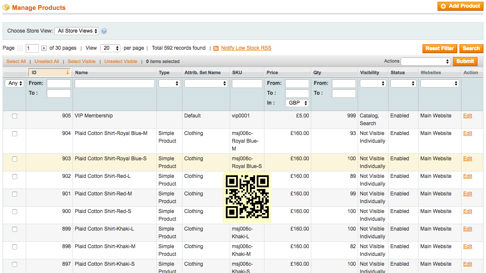
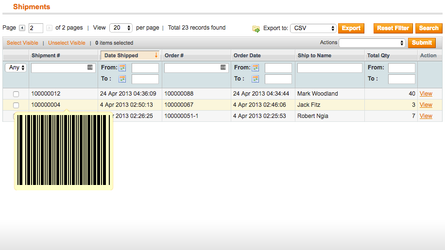
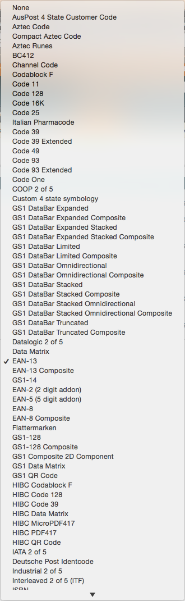

# Barcode Annotator Magento Module

This repository contains the source code for the Meanbee Barcode Annotator
Magento module.

The module adds barcode popups when a mouse hovers over a code in administrative
views. Codes that it adds barcodes to include:

-   Order Numbers
-   Invoice Numbers
-   Shipment Numbers
-   Credit Memo Numbers
-   Product SKU Codes

Each different type of code can be configured to use a different barcode
symbology. A full list of supported barcodes can be found in
[Metafloor's Barcode Writer in Pure JavaScript repo wiki](https://github.com/metafloor/bwip-js/wiki/Supported-Barcode-Symbologies).

## Screenshots

